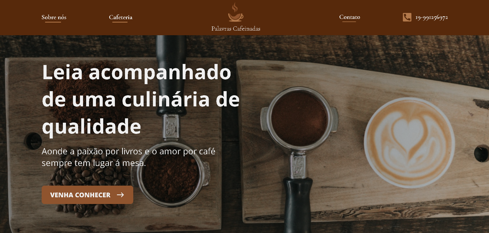
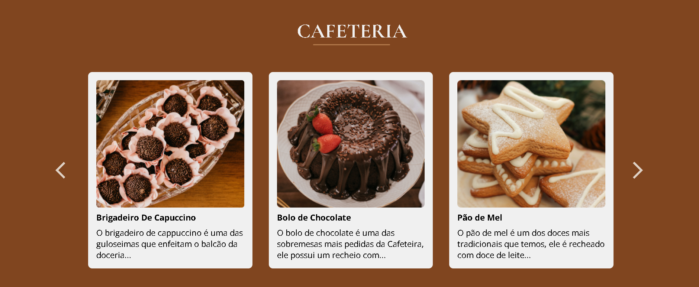

<h3 align="center">Projeto Trainee - Unect Jr.</h3>

 O objetivo deste projeto era desenvolver uma landing page de uma cafeteria fictícia, utilizando dos recursos e conhecimentos fornecidos durante as capacitações para a efetivação ao final do processo trainee da empresa júnior.
      

  <a href="https://unect.com.br/">Unect Jr.</a>

## 📝 Table of Contents

- [About](#about)
- [Built](#built_using)
- [Team](#team)

## 🧐 About 

  

O projeto incluiu as seguintes etapas:

- **Capacitação:** Aprofundar-se nos conhecimentos de HTML, CSS e JavaScript durante a semana de capacitação, para que pudessem ser utilizados nas três semanas de desenvolvimento posteriores.
- **Prototipação:** Analisar o design do Figma e discutir com o padrinho estratégias de como abordar o projeto, para poder estruturar a página da maneira mais fiel possível ao seu design original.
- **Front-end:** Com base no layout disponível, deveria realizar a codificação da interface previamente prototipada, tornando sua visualização agradável e responsiva, com um carrossel funcional e formulário com autenticação.

  

## ⛏️ Built Using 

&nbsp;
&nbsp;
&nbsp;
&nbsp;

## ✍️ Team 

- [Abner do Nascimento](https://github.com/abnerns) - Developer
- [Unect Jr.](mailto:unect@unect.com.br) - Product Owner